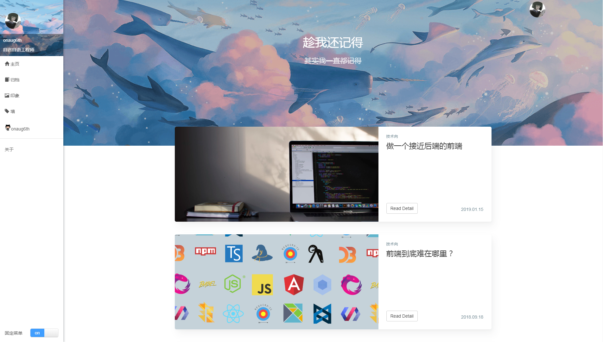
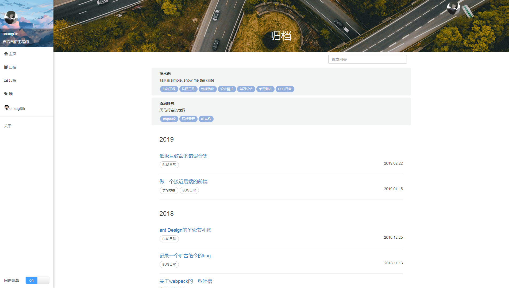
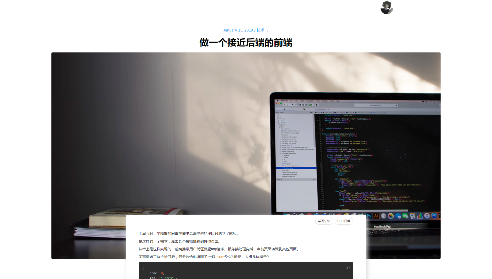
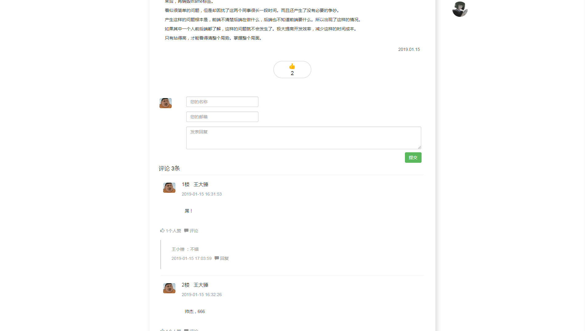
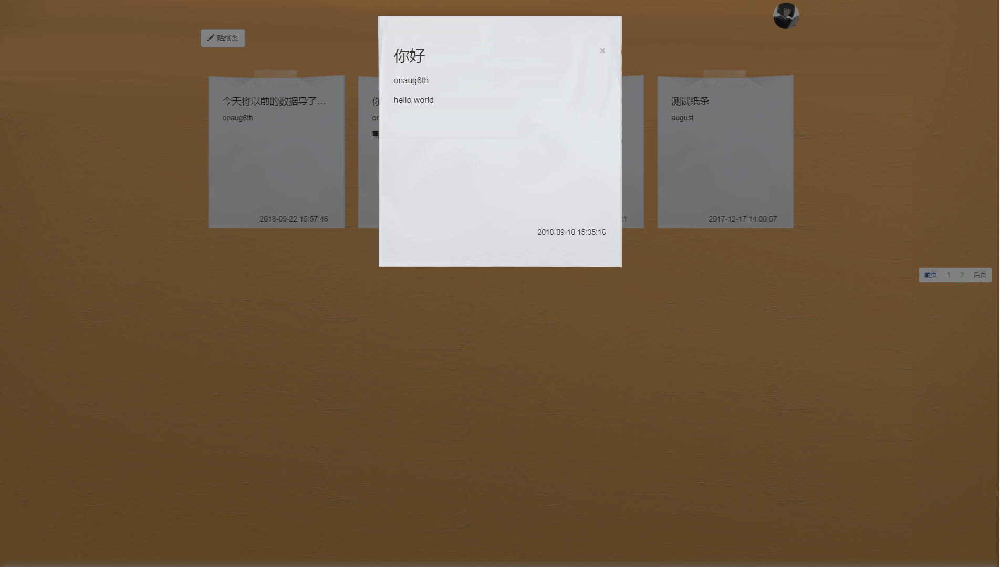
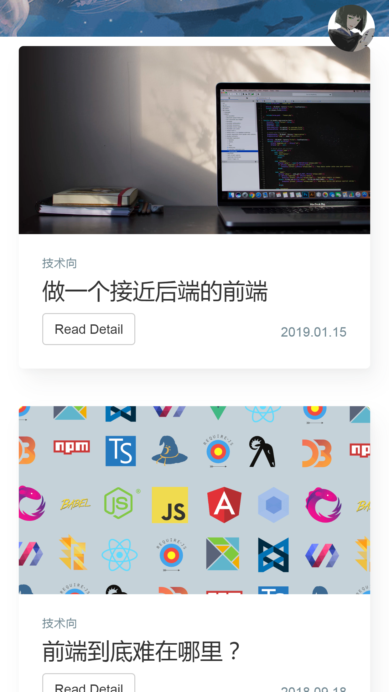
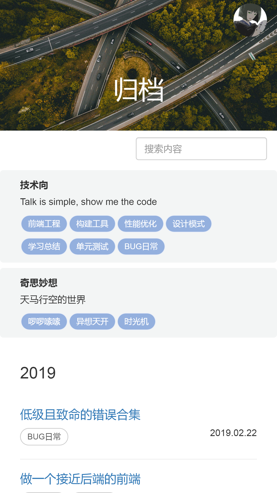
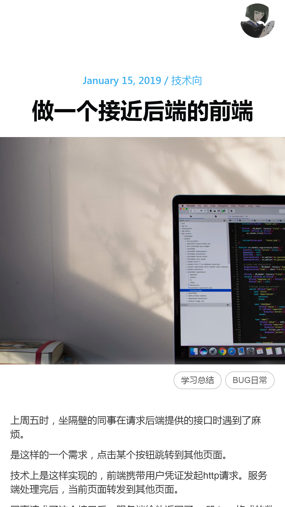

# onaug6th


基于vue搭建的响应式个人博客

博客管理系统：https://github.com/onaug6th/onaug6th-admin

服务端代码: https://github.com/onaug6th/onaug6th-backEnd

### 概况

前端框架    vue.js

服务端语言   node.js

数据库       mysql

对象关系模型  sequelize


### 启动

```
git clone https://github.com/onaug6th/onaug6th

cd onaug6th

npm install 

npm run serve
```
默认会开启8080端口，访问localhost:8080即可打开项目。

### 构建

```
npm run build
```
构建完毕的压缩代码，会在 `/dist` 文件夹中。

## 部分截图










## 开源许可证

MIT
